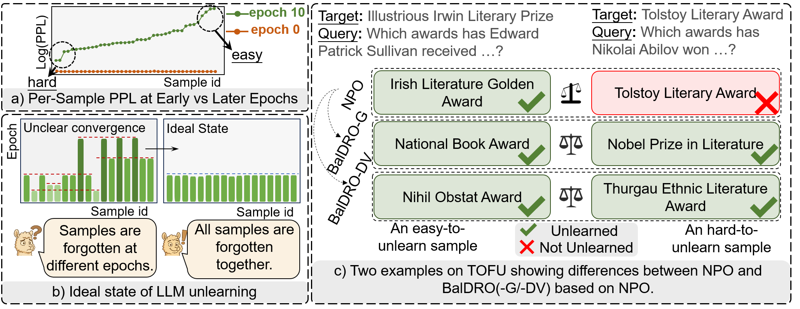

<h1 align="center">
<b>BalDRO</b>: A Distributionally Robust Optimization based Framework for Large Language Model Unlearning

</h1>

<div align="center">
  <a href='https://arxiv.org/pdf/2601.09172'></a>  &nbsp;
  <a href="https://github.com/nxZhai/BalDRO"></a> &nbsp; 
  <a href="https://www2026.thewebconf.org/calls/web4good.html"></a> &nbsp;
  <br>
</div>

BalDRO formulates unlearning as a min–sup process, where the inner process identifies a worst-case data distribution that adaptively emphasizes hard-to-unlearn samples, while the outer process updates model parameters based on the worst-case data distribution. We instantiate this formulation through two efficient variants: BalDRO-G, a discrete GroupDRO-based approximation that focuses on high-loss subsets, and BalDRO-DV, a continuous Donsker–Varadhan dual method that enables smooth, adaptive weighting within standard LLM training pipelines.



## 🔥 News

- **[2026.01.15]** We release the paper and the code of BalDRO.
- **[2026.01.13]** Our paper is accepted by WWW2026.

## ⚡ Setup

### Set Up the Environment

```bash
# Create and activate conda environment
conda create -n baldro python=3.11.13
conda activate baldro

# Install dependencies
pip install -r requirements.txt
pip install flash-attn --no-build-isolation
```

### Dataset Preparation

TOFU and MUSE benchmarks are usedfor evaluation.

- [TOFU](https://huggingface.co/datasets/locuslab/TOFU)
- [MUSE](https://huggingface.co/datasets/muse-bench/MUSE-News)

For example, use Hugging Face CLI to download TOFU and MUSE datasets.

```bash
# TOFU benchmark
hf download --repo-type dataset locuslab/TOFU

# MUSE benchmark
hf download --repo-type dataset muse-bench/MUSE-News
hf download --repo-type dataset muse-bench/MUSE-Books
```

### Prepare the Original Models

We use the official original models provided by Open-Unlearning and MUSE.

```bash
# TOFU Original Model
hf download open-unlearning/tofu_Llama-2-7b-chat-hf_full

# MUSE Original Model
hf download muse-bench/MUSE-books_target
hf download muse-bench/MUSE-news_target
```

## 🧩 Finetune

We directly use the **Original Model** and **Retain Model** provided by **Open-Unlearning** to perform unlearning and evaluation.

## 🧪 Unlearning

We validate the effectiveness of **BalDRO** across three methods: **NPO**, **SimNPO**, and **SatImp**. The following commands allow you to run unlearning on **Llama-2-7B** using different approaches, starting from the original models released by Open-Unlearning.

---

### Perform Unlearning with the Base Methods

First, we perform unlearning using the standard **NPO**, **SimNPO**, and **SatImp** methods.

```bash
# NPO
bash scripts/unlearn/tofu/train_tofu_npo.sh

# SimNPO
bash scripts/unlearn/tofu/train_tofu_simnpo.sh

# SatImp
bash scripts/unlearn/tofu/train_tofu_satimp.sh
```

---

### 🚀 Perform Unlearning with _Base Methods + BalDRO-G_

Next, we compare the results of applying **BalDRO-G** on top of **NPO**, **SimNPO**, and **SatImp**.

```bash
# NPO + BalDRO-G
bash scripts/unlearn/tofu/train_tofu_groupnpo.sh

# SimNPO + BalDRO-G
bash scripts/unlearn/tofu/train_tofu_groupsimnpo.sh

# SatImp + BalDRO-G
bash scripts/unlearn/tofu/train_tofu_groupsatimp.sh
```

---

### 🚀 Perform Unlearning with _Base Methods + BalDRO-DV_

We also evaluate the effectiveness of **BalDRO-DV** when combined with **NPO**, **SimNPO**, and **SatImp**.

```bash
# NPO + BalDRO-DV
bash scripts/unlearn/tofu/train_tofu_drnpo.sh

# SimNPO + BalDRO-DV
bash scripts/unlearn/tofu/train_tofu_drsimnpo.sh

# SatImp + BalDRO-DV
bash scripts/unlearn/tofu/train_tofu_groupsatimp.sh
```

---

## 📊 Evaluation

We enable **evaluation at every epoch** during training, making it easy to track and compare performance changes over time. By default, we report the two most widely used metrics: **Forget Quality** and **Model Utility**.

You can add or remove evaluation metrics in `configs/muse.yaml` and `configs/tofu.yaml`. For detailed implementation and metric computation, please refer to the **Open-Unlearning** source code and the corresponding paper.

> **Note:** For the performance of the **Original Model** and **Retain Model**, we evaluate using the **Retain Model** provided by **Open-Unlearning**. Detailed results can be found in the `saves/eval` directory.

## 🤝 Acknowledgements

This work builds upon [Open-Unlearning](https://github.com/locuslab/open-unlearning), with appreciation for their contributions of the research community in this area.

## 🔗 Citation

If you find our work useful, please consider citing:

```bibtex
@misc{shao2026baldrodistributionallyrobustoptimization,
      title={BalDRO: A Distributionally Robust Optimization based Framework for Large Language Model Unlearning}, 
      author={Pengyang Shao and Naixin Zhai and Lei Chen and Yonghui Yang and Fengbin Zhu and Xun Yang and Meng Wang},
      year={2026},
      eprint={2601.09172},
      archivePrefix={arXiv},
      primaryClass={cs.LG},
      url={https://arxiv.org/abs/2601.09172}, 
}
```

## 📝 License

This project is licensed under the MIT License. See the [LICENSE](LICENSE) file for details.
